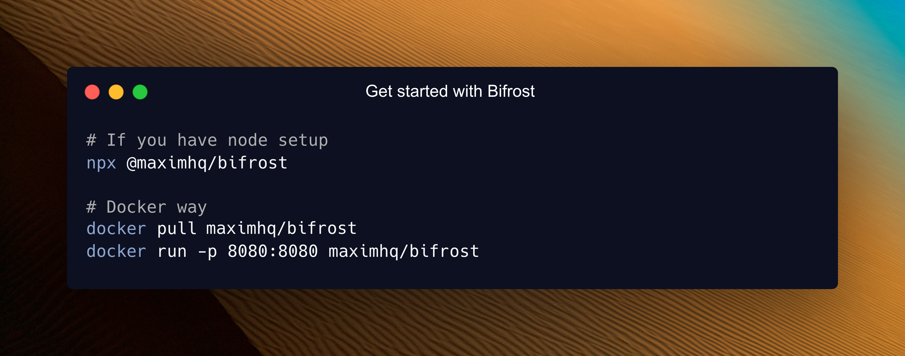
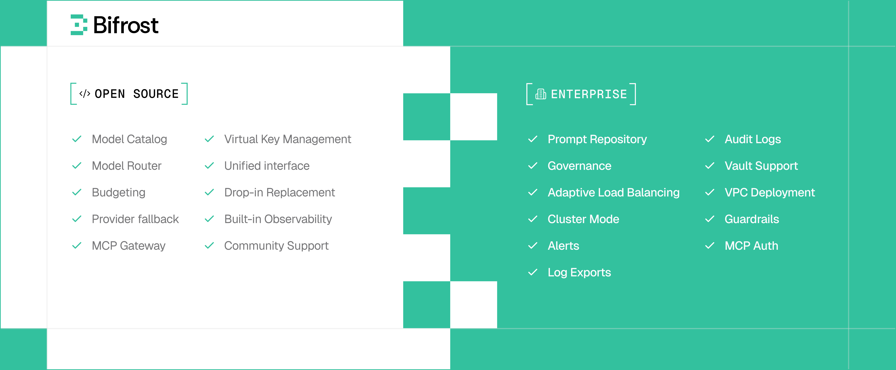

# Koutaku AI Gateway

[](https://goreportcard.com/report/github.com/koutaku/koutaku/core)
[](https://discord.gg/exN5KAydbU)
[](https://codecov.io/gh/koutaku/koutaku)

[](https://app.getpostman.com/run-collection/31642484-2ba0e658-4dcd-49f4-845a-0c7ed745b916?action=collection%2Ffork&source=rip_markdown&collection-url=entityId%3D31642484-2ba0e658-4dcd-49f4-845a-0c7ed745b916%26entityType%3Dcollection%26workspaceId%3D63e853c8-9aec-477f-909c-7f02f543150e)
[](https://artifacthub.io/packages/search?repo=koutaku)
[](LICENSE)

## The fastest way to build AI applications that never go down

Koutaku is a high-performance AI gateway that unifies access to 15+ providers (OpenAI, Anthropic, AWS Bedrock, Google Vertex, and more) through a single OpenAI-compatible API. Deploy in seconds with zero configuration and get automatic failover, load balancing, semantic caching, and enterprise-grade features.

## Quick Start



**Go from zero to production-ready AI gateway in under a minute.**

**Step 1:** Start Koutaku Gateway

```bash
# Install and run locally
npx -y @koutaku/koutaku

# Or use Docker
docker run -p 8080:8080 koutaku/koutaku
```

**Step 2:** Configure via Web UI

```bash
# Open the built-in web interface
open http://localhost:8080
```

**Step 3:** Make your first API call

```bash
curl -X POST http://localhost:8080/v1/chat/completions \
  -H "Content-Type: application/json" \
  -d '{
    "model": "openai/gpt-4o-mini",
    "messages": [{"role": "user", "content": "Hello, Koutaku!"}]
  }'
```

**That's it!** Your AI gateway is running with a web interface for visual configuration, real-time monitoring, and analytics.

**Complete Setup Guides:**

- [Gateway Setup](https://github.com/Barkasj/koutaku/tree/main/docs/quickstart/gateway/setting-up) - HTTP API deployment
- [Go SDK Setup](https://github.com/Barkasj/koutaku/tree/main/docs/quickstart/go-sdk/setting-up) - Direct integration

---

## Enterprise Deployments

Koutaku supports enterprise-grade, private deployments for teams running production AI systems at scale.
In addition to private networking, custom security controls, and governance, enterprise deployments unlock advanced capabilities including adaptive load balancing, clustering, guardrails, MCP gateway and and other features designed for enterprise-grade scale and reliability.




<div align="center" style="display: flex; flex-direction: column;">
  <a href="https://calendly.com/koutakuai/koutaku-demo">
    
  </a>
  <div>
  <a href="https://github.com/Barkasj/koutaku/koutaku/enterprise" target="_blank" rel="noopener noreferrer">Explore enterprise capabilities</a>
  </div>
</div>

---

## Key Features

### Core Infrastructure

- **[Unified Interface](https://github.com/Barkasj/koutaku/tree/main/docs/features/unified-interface)** - Single OpenAI-compatible API for all providers
- **[Multi-Provider Support](https://github.com/Barkasj/koutaku/tree/main/docs/quickstart/gateway/provider-configuration)** - OpenAI, Anthropic, AWS Bedrock, Google Vertex, Azure, Cerebras, Cohere, Mistral, Ollama, Groq, and more
- **[Automatic Fallbacks](https://github.com/Barkasj/koutaku/tree/main/docs/features/fallbacks)** - Seamless failover between providers and models with zero downtime
- **[Load Balancing](https://github.com/Barkasj/koutaku/tree/main/docs/features/fallbacks)** - Intelligent request distribution across multiple API keys and providers

### Advanced Features

- **[Model Context Protocol (MCP)](https://github.com/Barkasj/koutaku/tree/main/docs/features/mcp)** - Enable AI models to use external tools (filesystem, web search, databases)
- **[Semantic Caching](https://github.com/Barkasj/koutaku/tree/main/docs/features/semantic-caching)** - Intelligent response caching based on semantic similarity to reduce costs and latency
- **[Multimodal Support](https://github.com/Barkasj/koutaku/tree/main/docs/quickstart/gateway/streaming)** - Support for text,images, audio, and streaming, all behind a common interface.
- **[Custom Plugins](https://github.com/Barkasj/koutaku/tree/main/docs/enterprise/custom-plugins)** - Extensible middleware architecture for analytics, monitoring, and custom logic
- **[Governance](https://github.com/Barkasj/koutaku/tree/main/docs/features/governance)** - Usage tracking, rate limiting, and fine-grained access control

### Enterprise & Security

- **[Budget Management](https://github.com/Barkasj/koutaku/tree/main/docs/features/governance)** - Hierarchical cost control with virtual keys, teams, and customer budgets
- **[SSO Integration](https://github.com/Barkasj/koutaku/tree/main/docs/features/sso-with-google-github)** - Google and GitHub authentication support
- **[Observability](https://github.com/Barkasj/koutaku/tree/main/docs/features/observability)** - Native Prometheus metrics, distributed tracing, and comprehensive logging
- **[Vault Support](https://github.com/Barkasj/koutaku/tree/main/docs/enterprise/vault-support)** - Secure API key management with HashiCorp Vault integration

### Developer Experience

- **[Zero-Config Startup](https://github.com/Barkasj/koutaku/tree/main/docs/quickstart/gateway/setting-up)** - Start immediately with dynamic provider configuration
- **[Drop-in Replacement](https://github.com/Barkasj/koutaku/tree/main/docs/features/drop-in-replacement)** - Replace OpenAI/Anthropic/GenAI APIs with one line of code
- **[SDK Integrations](https://github.com/Barkasj/koutaku/tree/main/docs/integrations/what-is-an-integration)** - Native support for popular AI SDKs with zero code changes
- **[Configuration Flexibility](https://github.com/Barkasj/koutaku/tree/main/docs/quickstart/gateway/provider-configuration)** - Web UI, API-driven, or file-based configuration options

---

## Repository Structure

Koutaku uses a modular architecture for koutakuum flexibility:

```text
koutaku/
├── npx/                 # NPX script for easy installation
├── core/                # Core functionality and shared components
│   ├── providers/       # Provider-specific implementations (OpenAI, Anthropic, etc.)
│   ├── schemas/         # Interfaces and structs used throughout Koutaku
│   └── koutaku.go       # Main Koutaku implementation
├── framework/           # Framework components for data persistence
│   ├── configstore/     # Configuration storages
│   ├── logstore/        # Request logging storages
│   └── vectorstore/     # Vector storages
├── transports/          # HTTP gateway and other interface layers
│   └── koutaku-http/    # HTTP transport implementation
├── ui/                  # Web interface for HTTP gateway
├── plugins/             # Extensible plugin system
│   ├── governance/      # Budget management and access control
│   ├── jsonparser/      # JSON parsing and manipulation utilities
│   ├── logging/         # Request logging and analytics
│   ├── koutaku/           # Koutaku's observability integration
│   ├── mocker/          # Mock responses for testing and development
│   ├── semanticcache/   # Intelligent response caching
│   └── telemetry/       # Monitoring and observability
├── docs/                # Documentation and guides
└── tests/               # Comprehensive test suites
```

---

## Getting Started Options

Choose the deployment method that fits your needs:

### 1. Gateway (HTTP API)

**Best for:** Language-agnostic integration, microservices, and production deployments

```bash
# NPX - Get started in 30 seconds
npx -y @koutaku/koutaku

# Docker - Production ready
docker run -p 8080:8080 -v $(pwd)/data:/app/data koutaku/koutaku
```

**Features:** Web UI, real-time monitoring, multi-provider management, zero-config startup

**Learn More:** [Gateway Setup Guide](https://github.com/Barkasj/koutaku/tree/main/docs/quickstart/gateway/setting-up)

### 2. Go SDK

**Best for:** Direct Go integration with koutakuum performance and control

```bash
go get github.com/koutaku/koutaku/core
```

**Features:** Native Go APIs, embedded deployment, custom middleware integration

**Learn More:** [Go SDK Guide](https://github.com/Barkasj/koutaku/tree/main/docs/quickstart/go-sdk/setting-up)

### 3. Drop-in Replacement

**Best for:** Migrating existing applications with zero code changes

```diff
# OpenAI SDK
- base_url = "https://api.openai.com"
+ base_url = "http://localhost:8080/openai"

# Anthropic SDK  
- base_url = "https://api.anthropic.com"
+ base_url = "http://localhost:8080/anthropic"

# Google GenAI SDK
- api_endpoint = "https://generativelanguage.googleapis.com"
+ api_endpoint = "http://localhost:8080/genai"
```

**Learn More:** [Integration Guides](https://github.com/Barkasj/koutaku/tree/main/docs/integrations/what-is-an-integration)

---

## Performance

Koutaku adds virtually zero overhead to your AI requests. In sustained 5,000 RPS benchmarks, the gateway added only **11 µs** of overhead per request.

| Metric | t3.medium | t3.xlarge | Improvement |
|--------|-----------|-----------|-------------|
| Added latency (Koutaku overhead) | 59 µs | **11 µs** | **-81%** |
| Success rate @ 5k RPS | 100% | 100% | No failed requests |
| Avg. queue wait time | 47 µs | **1.67 µs** | **-96%** |
| Avg. request latency (incl. provider) | 2.12 s | **1.61 s** | **-24%** |

**Key Performance Highlights:**

- **Perfect Success Rate** - 100% request success rate even at 5k RPS
- **Minimal Overhead** - Less than 15 µs additional latency per request
- **Efficient Queuing** - Sub-microsecond average wait times
- **Fast Key Selection** - ~10 ns to pick weighted API keys

**Complete Benchmarks:** [Performance Analysis](https://github.com/Barkasj/koutaku/tree/main/docs/benchmarking/getting-started)

---

## Documentation

**Complete Documentation:** [https://github.com/Barkasj/koutaku/tree/main/docs](https://github.com/Barkasj/koutaku/tree/main/docs)

### Quick Start

- [Gateway Setup](https://github.com/Barkasj/koutaku/tree/main/docs/quickstart/gateway/setting-up) - HTTP API deployment in 30 seconds
- [Go SDK Setup](https://github.com/Barkasj/koutaku/tree/main/docs/quickstart/go-sdk/setting-up) - Direct Go integration
- [Provider Configuration](https://github.com/Barkasj/koutaku/tree/main/docs/quickstart/gateway/provider-configuration) - Multi-provider setup

### Features

- [Multi-Provider Support](https://github.com/Barkasj/koutaku/tree/main/docs/features/unified-interface) - Single API for all providers
- [MCP Integration](https://github.com/Barkasj/koutaku/tree/main/docs/features/mcp) - External tool calling
- [Semantic Caching](https://github.com/Barkasj/koutaku/tree/main/docs/features/semantic-caching) - Intelligent response caching
- [Fallbacks & Load Balancing](https://github.com/Barkasj/koutaku/tree/main/docs/features/fallbacks) - Reliability features
- [Budget Management](https://github.com/Barkasj/koutaku/tree/main/docs/features/governance) - Cost control and governance

### Integrations

- [OpenAI SDK](https://github.com/Barkasj/koutaku/tree/main/docs/integrations/openai-sdk) - Drop-in OpenAI replacement
- [Anthropic SDK](https://github.com/Barkasj/koutaku/tree/main/docs/integrations/anthropic-sdk) - Drop-in Anthropic replacement
- [AWS Bedrock SDK](https://github.com/Barkasj/koutaku/tree/main/docs/integrations/bedrock-sdk) - AWS Bedrock integration
- [Google GenAI SDK](https://github.com/Barkasj/koutaku/tree/main/docs/integrations/genai-sdk) - Drop-in GenAI replacement
- [LiteLLM SDK](https://github.com/Barkasj/koutaku/tree/main/docs/integrations/litellm-sdk) - LiteLLM integration
- [Langchain SDK](https://github.com/Barkasj/koutaku/tree/main/docs/integrations/langchain-sdk) - Langchain integration

### Enterprise

- [Custom Plugins](https://github.com/Barkasj/koutaku/tree/main/docs/enterprise/custom-plugins) - Extend functionality
- [Clustering](https://github.com/Barkasj/koutaku/tree/main/docs/enterprise/clustering) - Multi-node deployment
- [Vault Support](https://github.com/Barkasj/koutaku/tree/main/docs/enterprise/vault-support) - Secure key management
- [Production Deployment](https://github.com/Barkasj/koutaku/tree/main/docs/deployment/docker-setup) - Scaling and monitoring

---

## Need Help?

**[Join our Discord](https://discord.gg/exN5KAydbU)** for community support and discussions.

Get help with:

- Quick setup assistance and troubleshooting
- Best practices and configuration tips  
- Community discussions and support
- Real-time help with integrations

---

## Contributing

We welcome contributions of all kinds! See our [Contributing Guide](https://github.com/Barkasj/koutaku/tree/main/docs/contributing/setting-up-repo) for:

- Setting up the development environment
- Code conventions and best practices
- How to submit pull requests
- Building and testing locally

For development requirements and build instructions, see our [Development Setup Guide](https://github.com/Barkasj/koutaku/tree/main/docs/contributing/setting-up-repo#development-environment-setup).

---

## License

This project is licensed under the Apache 2.0 License - see the [LICENSE](LICENSE) file for details.

Built with ❤️ by [Koutaku](https://github.com/koutakuhq)
